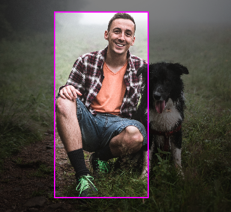
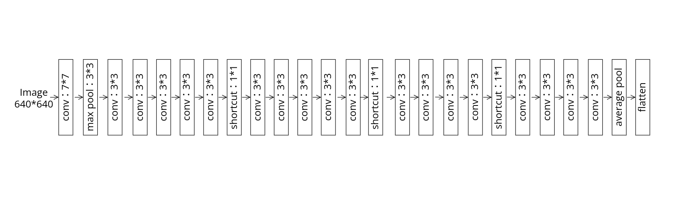
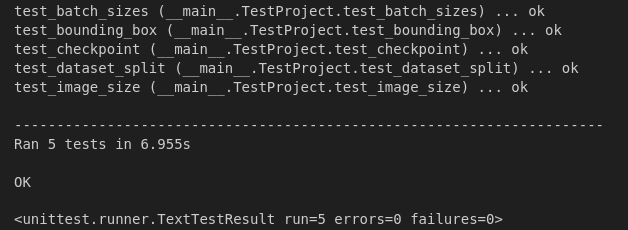
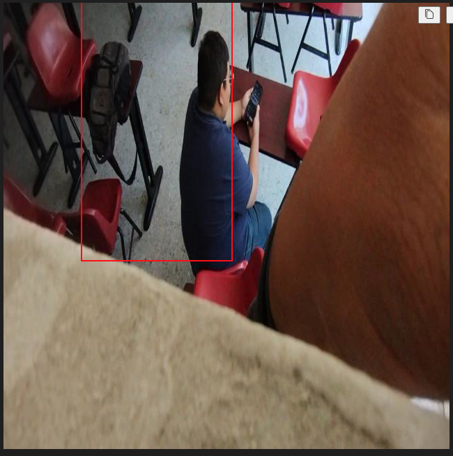
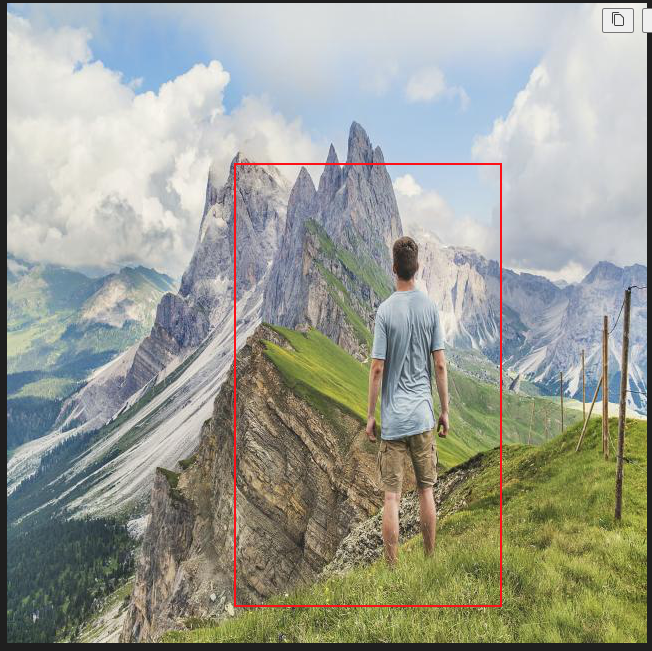

# Human Detection from Single Image
## Abstract
Human detection stands as a critical and dynamic area of research within the field of computer vision, particularly in object detection. This domain has witnessed substantial advancements in recent years, driven by the emergence of powerful computational techniques and innovative algorithms. The primary objective of this project is to explore and enhance human detection methodologies using deep learning approaches, a subset of machine learning characterized by its capability to learn hierarchical representations.

In this project, I will develop a deep neural network model that is specifically tailored for the task of human detection in various environments and conditions. The project aims to address common challenges in this area, such as varying lighting conditions, occlusions, and diverse human poses and clothing. The model will be designed to accurately identify and localize humans in images by generating precise bounding boxes around them. This involves the application of advanced convolutional neural networks (CNNs) and possibly other architectures like Residual Networks (ResNets), which have shown promising results in object detection tasks.

## Introduction
In the realm of modern computer vision, deep learning technology has emerged as a key driver for innovation in both research and application. My research journey began with an in-depth exploration of the topic of multi-person reconstruction from single images using deep learning. During this exploration, I realized that human detection is not just an independent research field but also a fundamental and necessary step for multi-person reconstruction. Accurate human detection forms the groundwork for understanding and analyzing the dynamics of humans in complex scenes, which is crucial for subsequent multi-person reconstruction efforts.

Based on this understanding, I have focused my research on the aspect of single-person human detection. This focus is aimed not only at mastering and optimizing the fundamental technique of human detection but also at laying a solid foundation for future research in multi-person reconstruction. By concentrating on single-person detection, we can delve deeper into understanding and addressing the challenges associated with human detection, such as varying environmental conditions, diverse poses, and occlusions.

Furthermore, the implementation of this project extends beyond academic research. Its potential applications are vast, encompassing areas including but not limited to surveillance systems, crowd management, autonomous driving, and human-computer interaction. In these applications, accurate single-person human detection is key to enhancing the overall performance and reliability of the system. For instance, in surveillance systems, accurate human detection can help improve safety; in the field of autonomous driving, it can enhance a vehicle's ability to recognize pedestrians, thereby boosting driving safety.

## Literature Reciew
Human detection, a critical aspect of computer vision, has seen significant advancements due to deep learning and convolutional neural networks (CNNs). Early approaches relied on feature-based methods like Histogram of Oriented Gradients (HOG) combined with Support Vector Machines (SVMs) for detection. However, these were limited in accuracy and adaptability.

Recent breakthroughs leverage deep learning for enhanced precision and robustness. YOLO (You Only Look Once) and SSD (Single Shot MultiBox Detector) represent major developments, offering real-time detection with high accuracy. These frameworks use deep CNNs to process images in a single pass, detecting humans in various poses and environments.

Attention-based mechanisms and region proposal networks, as seen in Faster R-CNN, further improve detection by focusing on relevant parts of an image. This adaptability is crucial in dynamic environments like autonomous driving and surveillance.

Despite progress, challenges remain in handling occlusions, varying lighting conditions, and diverse backgrounds. 

## Dataset
The COCO dataset is a comprehensive collection for computer vision, featuring over 200,000 labeled images across 80 object categories. Renowned for its detailed annotations, including object segmentation and bounding boxes, COCO is crucial for tasks like object detection and segmentation. It's widely used in research and model benchmarking, making it a cornerstone in advancing computer vision technologies.
I utilize the existing high-quality COCO dataset, which includes annotations for individuals along with corresponding bounding boxes. The dataset is processed to extract the subset containing data for individual persons, comprising a total of 2670 images.[Get Here](https://universe.roboflow.com/titulacin/person-detection-9a6mk/dataset/16)

##  Model

The neural network I'm using is a ResNet, a deep Convolutional Neural Network (CNN) with Residual Connections. This architecture excels in tasks like image recognition and classification. It features ResBlock modules, each with two convolutional layers, Batch Normalization, and ReLU activation. Residual connections in these blocks help avoid the vanishing gradient problem in deep networks.
.png)

The network starts with a 7x7 convolutional layer, followed by max pooling, Batch Normalization, and ReLU activation (layer0). Subsequent stages (layer1 to layer4) contain multiple residual blocks for feature extraction and learning.

After these stages, global average pooling reduces the feature maps to 1x1, followed by a fully connected layer for the final output. This ResNet structure efficiently learns complex features, making it highly suitable for high-dimensional data like images.

## UnitTest
The unit tests within the TestProject class serve as validation mechanisms for critical project components. These tests cover two main aspects:

The first test, test_checkpoint, assesses the functionality of saving model checkpoints. It involves creating a mock deep learning model, specifying a training epoch, and defining a directory for checkpoint storage. This test ensures that the checkpoint file is successfully generated and validates its existence. Additionally, it manages the cleanup of the checkpoint file and directory.

The second test, test_image_size, verifies whether loaded images meet the required size criteria of 640x640 pixels. It uses a sample test image and checks if the dimensions of the loaded image tensor match the expected values, including 3 channels and a 640x640 size. These unit tests are essential for ensuring the reliability and functionality of the project's deep learning model and image processing components by detecting errors early in the development process.

The third test， test_bounding_box, evaluates the accuracy of bounding box predictions made by a neural network. The test involves loading an image, processing it through the network, and extracting the bounding box coordinates. It then asserts that the maximum coordinates (bbox_x_max, bbox_y_max) are greater than the minimum ones (bbox_x, bbox_y), ensuring that the bounding box is valid and correctly oriented. This test is crucial for verifying the network's ability to accurately localize objects within an image.

The fourth test， test_batch_sizes, checks the batch size consistency of data loaders in a deep learning pipeline. It loads the training, validation, and testing datasets using a specified batch size, then iteratively checks each batch in these datasets. The test ensures that all batches, except the last batch in each dataset, contain the correct number of samples as defined by the batch size. This test is important for verifying that the data loading process is correctly batching samples, which is crucial for efficient and effective training of neural network models.

The final test， test_dataset_split, aims to ensure the integrity of the dataset split into training, validation, and testing sets. After loading the datasets, it calculates the number of samples in each set and compares the total with the overall number of samples available in the original dataset. The test verifies that the sum of samples in the training, validation, and test sets approximately equals the total number of samples, ensuring that the dataset is split correctly and no data is missing or duplicated. This verification is vital for maintaining the reliability of model training and evaluation processes.

## Results
### Results with MSE
Results indicates that human detection utilizing the Mean Squared Error (MSE) as a loss function yields suboptimal results. MSE, focusing on pixel-level differences, struggles to accurately identify and delineate human contours. Consequently, the generated bounding boxes often fail to fully encompass the human figure, compromising detection accuracy and completeness. 

### Results with IoU
Utilizing Intersection over Union (IoU) as the loss function in human detection has shown significant improvement over Mean Squared Error (MSE)-based methods. IoU, which measures the overlap between predicted and actual bounding boxes, more accurately captures human figures. This results in bounding boxes that are more comprehensive and inclusive of the human form, enhancing detection precision. The IoU-based approach thus outperforms MSE in terms of accurately defining human contours, underlining its efficacy in complex detection tasks.

## Discussion
In this human detection project, using the Intersection over Union (IoU) as a loss function often yields better results compared to Mean Squared Error (MSE) due to several key reasons:

- Alignment with Object Detection Goals: IoU directly measures the overlap between the predicted bounding box and the ground truth, which is a core objective in object detection. A higher IoU indicates a more accurate prediction. MSE, on the other hand, calculates the average squared difference between the predicted and actual values, which may not directly correlate with how well the bounding box fits the object.

- Scale Invariance: IoU is scale-invariant, meaning it treats large and small objects equally in terms of relative accuracy. MSE is sensitive to the scale of the bounding box, often penalizing errors in large objects more than in small ones, which can lead to biases in model training.

- Robustness to Non-Overlapping Boxes: IoU provides a meaningful gradient even when the predicted bounding box does not overlap with the ground truth (IoU = 0 in this case). In contrast, MSE can give misleading gradients in such scenarios, as it doesn't consider the spatial relationship between boxes.

- Handling of Aspect Ratios: IoU naturally accounts for the aspect ratio of the bounding boxes, which is crucial in detecting objects of various shapes and sizes. MSE does not inherently consider aspect ratios, potentially leading to less accurate detections for objects that are not square or rectangular.

- Better Gradients for Learning: IoU-based loss functions tend to provide gradients that are more aligned with improving the detection performance, especially in challenging cases like small or overlapping objects. MSE might lead to suboptimal learning in these scenarios.

## Future works
### Advanced Loss Functions for Enhanced Detection Accuracy:
In human detection, advanced loss functions and techniques could offer substantial improvements in accuracy and effectiveness. GIoU (Generalized IoU) Loss enhances the model's handling of overlapping bounding boxes by considering both the overlap area and the area outside the union of the predicted and actual boxes. DIoU (Distance IoU) Loss further refines accuracy by focusing on the central point distance between the predicted and ground truth bounding boxes, reducing location errors in detections. CIoU (Complete IoU) Loss incorporates the aspect ratio, significantly improving detection accuracy for humans in various shapes and postures. Additionally, implementing Non-Maximum Suppression (NMS) using DIoU can refine the bounding box selection process, ensuring more accurate detections are retained, which is particularly beneficial in crowded scenes. Each of these methods brings unique improvements to the field, contributing to more precise and reliable human detection in diverse environments.
### Utilizing Human Detection as a Precursor for Multiple Person Reconstruction:
This project can be extended to reconstruct multiple human figures in complex scenes. Accurate human detection forms the foundation, and upon this, advanced algorithms can be built for 3D reconstruction, providing detailed insights into crowd dynamics, interactions, or even for augmented reality applications.

## Conclusion
In summary, this deep learning-based project has achieved human detection in the field of computer vision. By utilizing the ResNet architecture, a variant of convolutional neural networks, we accomplished human detection in various environments and conditions, including different poses, attire, lighting conditions, or occlusions. The use of the high-quality COCO dataset was instrumental in training a model capable of precisely generating bounding boxes around individual figures. Notably, transitioning the loss function from Mean Squared Error (MSE) to Intersection over Union (IoU) significantly enhanced the model's accuracy in capturing human contours and shapes. This project not only realizes the fundamental technique of single-person human detection but also lays a solid foundation for future exploration in multi-person reconstruction. The results demonstrate the critical role of advanced loss functions and deep learning architectures in improving and advancing the capabilities of human detection systems.
## Reference
[1] Lin, Tsung-Yi, et al. "Microsoft coco: Common objects in context." Computer Vision–ECCV 2014: 13th European Conference, Zurich, Switzerland, September 6-12, 2014, Proceedings, Part V 13. Springer International Publishing, 2014.

[2]Sarker, Iqbal H. "Machine learning: Algorithms, real-world applications and research directions." SN computer science 2.3 (2021): 160.

[3]Rezatofighi, Hamid, et al. "Generalized intersection over union: A metric and a loss for bounding box regression." Proceedings of the IEEE/CVF conference on computer vision and pattern recognition. 2019.

[4]Zheng, Zhaohui, et al. "Distance-IoU loss: Faster and better learning for bounding box regression." Proceedings of the AAAI conference on artificial intelligence. Vol. 34. No. 07. 2020.

[5]Zheng, Zhaohui, et al. "Enhancing geometric factors in model learning and inference for object detection and instance segmentation." IEEE transactions on cybernetics 52.8 (2021): 8574-8586.
